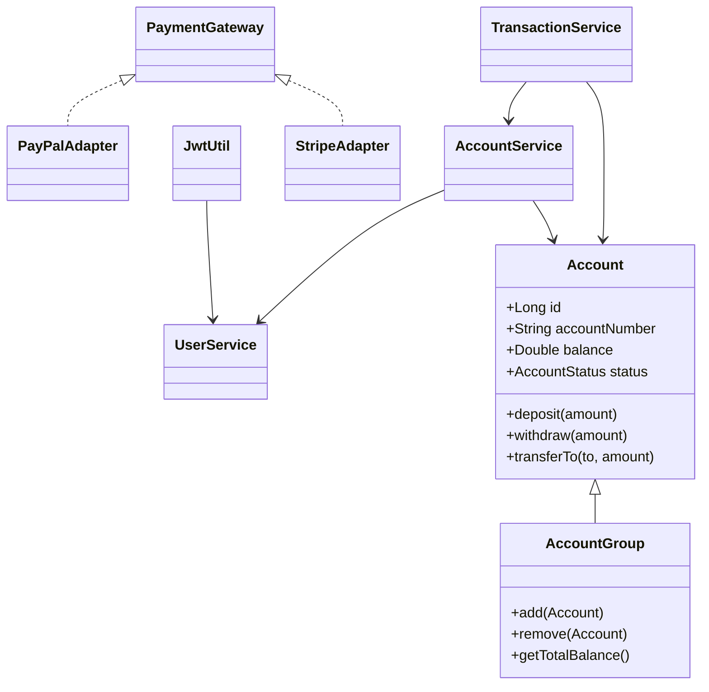
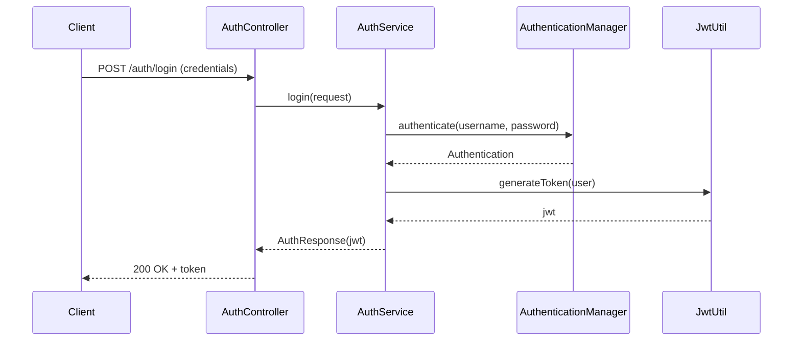
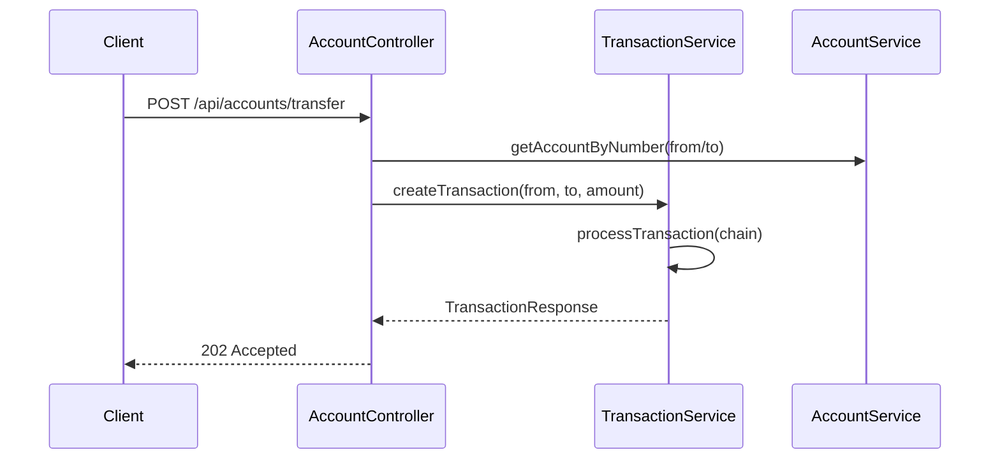
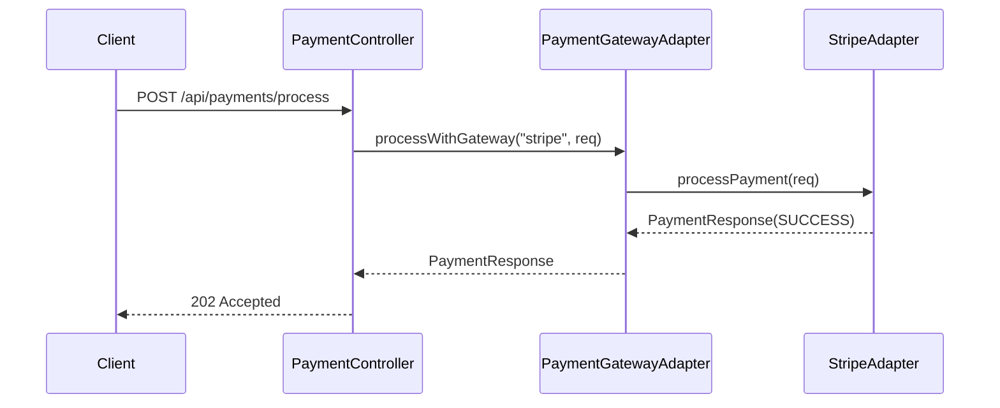
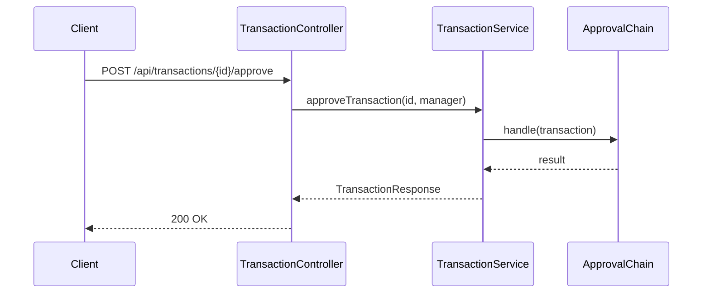

# UML Diagrams (Mermaid)

## Class Diagram

```mermaid
classDiagram
    class Account {
      +Long id
      +String accountNumber
      +Double balance
      +AccountStatus status
      +deposit(amount)
      +withdraw(amount)
      +transferTo(to, amount)
    }
    class AccountGroup {
      +add(Account)
      +remove(Account)
      +getTotalBalance()
    }
    class AccountService
    class TransactionService
    class UserService
    class JwtUtil
    class PaymentGateway
    class StripeAdapter
    class PayPalAdapter
    Account <|-- AccountGroup
    AccountService --> Account
    TransactionService --> Account
    TransactionService --> AccountService
    AccountService --> UserService
    JwtUtil --> UserService
    PaymentGateway <|.. StripeAdapter
    PaymentGateway <|.. PayPalAdapter
```

## Sequence: Login

```mermaid
sequenceDiagram
    participant Client
    participant AuthController
    participant AuthService
    participant AuthenticationManager
    participant JwtUtil
    Client->>AuthController: POST /auth/login (credentials)
    AuthController->>AuthService: login(request)
    AuthService->>AuthenticationManager: authenticate(username, password)
    AuthenticationManager-->>AuthService: Authentication
    AuthService->>JwtUtil: generateToken(user)
    JwtUtil-->>AuthService: jwt
    AuthService-->>AuthController: AuthResponse(jwt)
    AuthController-->>Client: 200 OK + token
```

## Sequence: Transfer Money

```mermaid
sequenceDiagram
    participant Client
    participant AccountController
    participant TransactionService
    participant AccountService
    Client->>AccountController: POST /api/accounts/transfer
    AccountController->>AccountService: getAccountByNumber(from/to)
    AccountController->>TransactionService: createTransaction(from, to, amount)
    TransactionService->>TransactionService: processTransaction(chain)
    TransactionService-->>AccountController: TransactionResponse
    AccountController-->>Client: 202 Accepted
```

## Sequence: Payment (Adapter)

```mermaid
sequenceDiagram
    participant Client
    participant PaymentController
    participant PaymentGatewayAdapter
    participant StripeAdapter
    Client->>PaymentController: POST /api/payments/process
    PaymentController->>PaymentGatewayAdapter: processWithGateway("stripe", req)
    PaymentGatewayAdapter->>StripeAdapter: processPayment(req)
    StripeAdapter-->>PaymentGatewayAdapter: PaymentResponse(SUCCESS)
    PaymentGatewayAdapter-->>PaymentController: PaymentResponse
    PaymentController-->>Client: 202 Accepted
```

## Sequence: Transaction Approval

```mermaid
sequenceDiagram
    participant Client
    participant TransactionController
    participant TransactionService
    participant ApprovalChain
    Client->>TransactionController: POST /api/transactions/{id}/approve
    TransactionController->>TransactionService: approveTransaction(id, manager)
    TransactionService->>ApprovalChain: handle(transaction)
    ApprovalChain-->>TransactionService: result
    TransactionService-->>TransactionController: TransactionResponse
    TransactionController-->>Client: 200 OK
```
```

